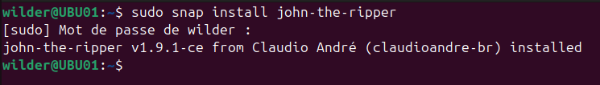
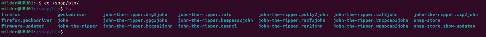
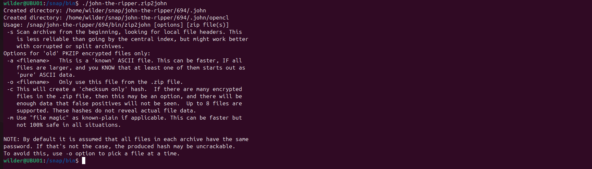
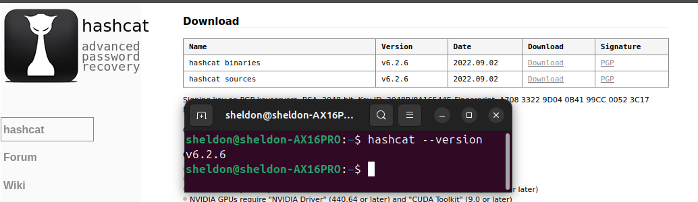

## Sommaire

1. [Prérequis technique](#prerequis-technique)
2. [Installation sur le serveur](#installation-sur-le-serveur)
3. [Installation sur le client](#installation-sur-le-client)
4. [FAQ](#faq)

# 1. Prérequis technique

Pour ce projet, nous avons besoin de deux VM :
- Une VM serveur Windows 2022 : **SERVWIN01**
- Une VM client Ubuntu : **UBU01**

Nous devons ensuite les mettre en réseau. Pour ce faire nous allons rajouter à chacune une deuxième carte réseau en "réseau interne" avec le même nom, ici "intnet".

Une fois cela fait, nous allons configurer l'adresse ip de SERVWIN01 de la deuxième carte réseau avec cette adresse : **172.16.10.5**

Nous configurons également l'ip de UBU01 de "intnet" avec cette adresse ip : **172.16.10.10**

# 2. Installation sur le serveur

Sur SERVWIN01, nous allons commencer par télecharger le logiciel **7zip**. Nous le téléchargeons via ce lien : _https://www.7-zip.org/_ et l'installons sur la machine.

Nous pouvons maintenant compresser des fichiers et les chiffrer. 

Nous allons créer deux fichiers : _secret_defense1.txt_ et _secret_defense2.txt_ dans le repertoire C://.

Puis nous allons les compresser et les chiffrer avec 7zip : 

- Clique droit sur le fichier puis choisir _"add to archive"_
- Cocher l'option _synchronise files_
- Ne rien modifier des différentes options
- Choisir le mot de passe dans la case correspondant. Ici nous allons choisir **1234**
- Cocher la case "encrypte file name"
 
Les fichiers sont maintenant chiffrés grâce à 7zip sur SERVWIN01.

# 3. Installation sur le client

Pour la machine client UBU01, nous avons besoin d'installer le logiciel _John_the_ripper_ ainsi que _hashcat_. 

### John-the-ripper

Sur un terminal, nous utiliserons les commandes suivantes pour installer les logiciels.

    sudo snap install john-the-ripper
    

Recherche emplacement John-the-ripper

    which john-the-ripper 

Déplacement dans /snap/bin

    cd /snap/bin

Regarder dans /snap/bin.

    ls

Affichage des modules John-the-ripper

Activer le module

    ./john-the-ripper.zip2john

### Hashcat

Via le terminal, nous allons utiliser la commande suivante pour télécharger le logiciel HashCat: 

    sudo apt install hashcat
       
Cette commande va également installer les configurations système requise (en anglais _requiered dependencies_).

Maintenant nous allons voir pour télecharger la dernière version de notre logiciel en commencant par les outils de developpement :

    sudo apt install -y build-essential git

(Optionnel) Ensuite, nous allons cloner le Hashcat Git repository : 

    git clone https://github.com/hashcat/hashcat.git

Une fois installé, nous allons nous déplacer dans le dossier hashcat : 

    cd hashcat

Compiler le code présent : 

    make 

Maintenant, nous pouvons installer hashcat avec la dernière version :
    
    sudo make install

Pour être sûr que nous soyons à jour, nous allons utiliser cette commande : 

    hashcat --version 

Félicitations ! Vous avez installé avec succés le logiciel Hashcat. Pour de plus amples informations, vous pouvez consulter l'aide en tapant cette commande dans votre terminal : 

    hashcat --help

    

# 4. FAQ

### **Ces logiciels sont ils disponibles gratuitement ?**

- Oui, ces logiciels sont **Open Sources**.

### **Doit-on bien connaître le milieu de la cybersécurité pour pouvoir les utiliser ?**

- Hashcat nécessite effectivement quelques connaissances et est peu ergonomique. Mais c'est le plus puissant des deux.
  John quant à lui a une approche plus "simple", permet d'être plus autonome grâce à un mode "automatique" mais a une puissance moindre.

### Ces logiciels ont-ils besoin de beaucoup d'espace mémoire ?

- Non, ce sont des outils relativement _léger_.

### Est-il légal de les utiliser ?

- Oui s'ils sont utilisés avec l'accord de la personne qui détient les fichiers. Il est cependant interdit de les utiliser sans le consentement d'un utilisateur. 
