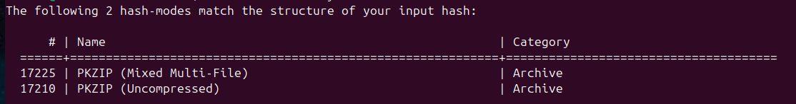

# Sommaire

1. [Utilisation de base](#utilisation-de-base)
2. [Utilisation avancée](#utilisation-avancee)
3. [FAQ](#faq)

# Guide d’utilisation

Ce guide explique comment utiliser **John-the-Ripper** *(Utilisation de base et Utilisation avancée pour les options)* et **Hashcat** *(Utilisation avancée)* pour casser les mots de passe de fichiers ZIP. Ce guide suppose que vous avez déjà configuré l’environnement et installé les outils, comme décrit dans [install.md](install.md).

### Prérequis

Avant de commencer, assurez-vous que :

- Le fichier ZIP à tester (par exemple, `fichier.zip`) est accessible sur le client Ubuntu dans le dossier partagé avec le serveur, comme décrit dans [install.md](install.md). 

 
 
 # 1. Utilisation de base
 

  ## John-The-Ripper

L'utilisation de base fonctionnera bien pour des mots de passe simples.

Avec les commandes décrites ci-dessous John-The-Ripper procédera de manière automatique et lancera 3 modes d'attaque en suivant : "Single Crack" sur la base des informations accessibles sur le fichier ZIP, "Wordlist" une liste de mots de passe est incluse avec John The Ripper, et enfin une attaque "Incremental" (force brute) pour tester toutes les combinaisons possibles. *(Pour ce dernier mode d'attaque, en fonction de la complexité du mot de passe, la durée nécessaire peut être 
extrêmement longue. Dans ce cas il est conseillé de se reporter à la partie Utilisation Avancée de ce guide.)*

- Tout d'abord copier le fichier zip (disponible dans le dossier partagé avec le serveur ) vers votre dossier personnel.

A l'aide du terminal déplacez-vous dans le dossier d'installation :

>   cd /snap/bin

Exécuter le fichier comme ci-dessous pour activer l'outil nécessaire à l'extraction des informations contenues dans le fichier:

> ./john-the-ripper.zip2john

Ensuite il est nécessaire d'extraire ces informations (hash) et de les stocker dans un fichier au format .txt. 

*(Dans les commandes vous remplacerez fichier.zip par le nom de votre propre fichier .zip et hash.txt par le nom de votre propre fichier.txt.)*

>john-the-ripper.zip2john fichier.zip > hash.txt

Vérifiez que les informations sont bien disponibles dans le fichier au format.txt :
 > cat hash.txt

Ensuite pour lancer une attaque de mots de passe du fichier.zip entrez la commande:

>john hash.txt

*(remplacez  hash.txt par le nom de votre fichier.txt)*

Le message à l'écran vous indique que la recherche du mot de passe a commencé et vous montre également les limites de format de mots de passe que John-The-Ripper sera en mesure de traiter.*(voir Utilisation avancée pour plus de détails)*
.
Vous pouvez appuyer sur la touche "Entrée" du clavier pour suivre l'avancement de la recherche. 

- Quand le mot de passe a été trouvé il apparait à l'écran.

Vous pouvez également le retrouver en entrant la commande:

>john --show hash.txt

*(Remplacer "hash.txt" par le nom de votre fichier.txt)*

- Ajoutez la permission en éxécution sur votre fichier .zip :

> chmod u+x fichier.zip

- Déverouillez votre fichier .zip avec le code : vous pouvez maintenant accéder au dossier qui contient votre ficher.zip.

Si John-The-Ripper ne parvient pas à trouver le mot de passe ou si l'attaque "Incremental" est trop longue, vous pouvez envisager les solutions décrites dans la partie Utilisation avancée de ce guide.

 # 2. Utilisation avancée
 

## [John-The-Ripper](https://www.openwall.com/john/)

Des options sont disponibles pour optimiser la recherche de mots de passe de fichiers ZIP en modifiant la commande de base:

>*john hash.txt*

- Pour augmenter la puissance utilisée par John The Ripper vous pouvez allouer le nombre de coeurs utilisés *(Remplacez "n" par le nombre de coeurs souhaité)*

>john --fork=n --format=PKZIP hash.txt

- Pour une recherche de mot de passe contenant des caractères spéciaux, ajoutez les options suivantes à la commande:

> john --encoding=UTF8 --format=PKZIP hash.txt

Il est à noter qu'une limitation existe  suivant les charactères utilisés dans le mot de passe recherché: 21 caractères pour UTF-8 ou 63 pour ASCII. 

- Vous pouvez choisir une "Wordlist" personnalisée en format .txt, tous les mots contenus dans la liste doivent êtres les uns en dessous des autres.

> john --wordlist=/chemin/vers/mawordlist.txt

John The Riper permet de s'attaquer à de nombreuse solutions de chiffrement, pour en savoir plus vous pouvez consulter le [site officiel](https://openwall.info/wiki/).

## [Hashcat](https://hashcat.net/hashcat/)

Pour déchiffrer les mots de passe de fichiers .zip avec Hashcat, il faut au préalable utiliser les ressources de John-The-Ripper pour extraire les données qui permettront de lancer l'attaque avec Hashcat. Dans le cas présent, les 2 logiciels sont complémentaires.

- Pour récupérer le hash du fichier .zip utilisez le même procédé que celui décrit dans l'utilisation de [John The Ripper](#john-the-ripper)

- Ensuite procédez comme dans l'exemple suivant en modifiant le format obtenu dans le fichier.txt : *(Remplacez par le nom de votre fichier.txt)* 

Vous obtiendrai un sortie ressemblant à celle ci-dessous. 
Pour que le fichier soit utilisable par hashcat il faut retirer le préfixe et le suffixe de ce hash --> vous conserverai uniquement la partie du hash incluse entre le premier et le dernier délimiteur indiqués par le symbole \$.
Les symboles \$ doivent êtres inclus dans le fichier.txt (comme les éléments en gras ci-dessous)

- Format du hash avant modification

>fichier.zip/test.txt:**\$pkzip\$ 1120291ef8ed8c9c026829f8edd9619940983e26db002967fb9a11f694a1c8be3781c1711b9ba30026a37fd2696bb288c7a239cd2fc1$/pkzip$**:test.txt:fichier.zip::fichier.zip

- Après modification le hash devra avoir ce format :

>**\$pkzip\$ 1120291ef8ed8c9c026829f8edd9619940983e26db002967fb9a11f694a1c8be3781c1711b9ba30026a37fd2696bb288c7a239cd2fc1$/pkzip$**

- Editez le fichier avec nano pour modifier le hash comme indiqué.

>nano hash.txt

## Utilisation de Hashcat

Maintenant que le hash est convertit dans un format exploitable par hascat il est nécessaire de tester le hash obtenu pour s'assurer qu'il sera exploitable par Hashcat

>hashcat --identify hash.txt

Vous obtiendrez une sortie sous cette forme:

Vous voyez ici les modes à employer en fonction du hash extrait de votre fichier.zip

### Attaques par dictionnaire : 
Hascat permet d'avoir recours à des listes de mots de passe ("Wordlist") cependant elles ne sont pas incluses par défaut. 

En ligne il est possible de trouver des listes gratuites, comme par exemple sur [RockYou](https://github.com/brannondorsey/naive-hashcat/releases/download/data/rockyou.txt) ou [CrackStation](https://crackstation.net/) .

Pour réaliser une attaque par dictionnaire en utilisant le fichier .txt modifié, la commmande dépendra du type de hash récupéré précédemment.

- Exemple de commande pour un format de hash \$pkzip2\$

>hashcat -m 17200 -a 0 hash.txt wordlist.txt

- -a : défini le mode d'attaque

-  -a 0 : Attaque par dictionnaire

  Lorsque hashcat aura trouvé le mot de passe il apparaitra à l'écran. 

- Ajoutez la permission en éxécution sur votre fichier .zip :

> chmod u+x fichier.zip

- Déverouillez votre fichier .zip avec le code : vous pouvez maintenant accéder au dossier qui contient votre ficher.zip.

### Attaques par force brute

Ce type d'attaque a pour but de tester toute les combinaisons possibles, la durée de l'attaque dépendra de la complexité du mot de passe et des ressources matérielles allouées.

Par défaut hashcat utilisera
les ressources en GPU sinon le CPU.

La aussi il vous sera nécéssaire de récupérer le hash dans un format compatible comme nous l'avons vu [plus haut](#hashcat) pour utiliser le [mode adapté](#hashcat) à votre fichier .zip.

- Exemple de commande minimale avec hashcat en force brute :

>hashcat -m 17200 -a 3 hash.txt

- *-m 17200 : représente le mode utilisé pour le type de hash obtenu*

- *-a 3 : Mode force brute*

Pour choisir les caractéristique de votre attaque, hascat utilise des masques.

- Exemple de commande avec un masque :

>hashcat -m 17200 -a 3 hash.text ?l?d?l?d

Ici le masque indique une recherche sur 4 caractères avec lettres minuscules et des chiffres.  

Voici un exemple des types de caractères qu'il est possible d'inclure dans les recherches :

-  ?l --> lettres minuscules

- ?u --> lettres majuscules

- ?d --> chiffres de 0 à 9

- ?s --> Symboles 

Ici nous avons procédé à une attaque par masque, d'autres modes sont disponibles :
- Attaque par combinaison
- Attaque hybride dictionnaire + masque
- Attaque hybride masque + dictionnaire
- Attaque par empreinte (moins courant)

  Lorsque hashcat aura trouvé le mot de passe il apparaitra à l'écran.

- Ajoutez la permission en éxécution sur votre fichier .zip :

> chmod u+x fichier.zip

- Déverouillez votre fichier .zip avec le code : vous pouvez maintenant accéder au dossier qui contient votre ficher.zip.

Pour plus de détails rendez-vous sur le [sites officiel](https://hashcat.net/wiki/)

 # 3. FAQ
 

### Est-ce légal?

Le pratiques abordées dans ce projet sont réservées à un cadre éthique. Il est impératif d'avoir la propriété des fichiers testés ou le consentement du propriétaire des fichiers.

### Pourquoi mon fichier .txt ne contient aucune donnée après avoir éxécuté cette commande? 
> john-the-ripper.zip2john fichier.zip > hash.txt

Assurez-vous que le fichier est bien protégé par un mot de passe sinon john-the-ripper ne génère pas de hash.

### Comment savoir quel mode d'attaque est en cours avec John-The-Ripper?

Appyuez sur "Entrée", cela affichera l'état actuel et les tentatives en cours.  

### Que faire si l'attaque incrémentale de John-The-Ripper prend trop de temps?

Interrompez l'attaque avec "Ctrl + c"  et passez à une attaque avancée ou utlisez Hashcat.

### Pourquoi Hashcat ne reconnait pas le hash fourni par John-The-Ripper

Asurrez-vous d'avoir enlevé correctement le suffixe et le préfixe du hash extrait par John-The-Ripper. 
Certains formats de hash ne fonctionnent pas avec hashacat ou parfois il est nécessaire d'adapter le mode d'attaque. Reportez vous au [guide des hash fourni par Hashcat ](https://hashcat.net/wiki/doku.php?id=example_hashes).

### Pourquoi le mot de passe trouvé ne déverrouille pas mon fichier .zip?

Vérifiez que vous avez bien les droits d'exécution sur le fichier ou éxécutez cette commande en remplaçant le nom de votre fichier:

>chmod u+x fichier.zip

